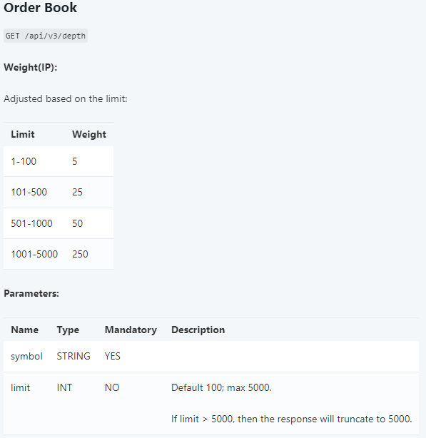
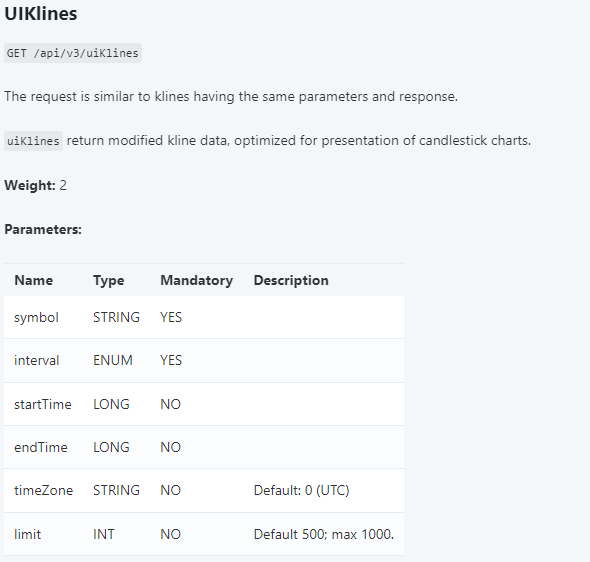

### Информация о получении данных на Binance для пары BTCUSDT

Открываем [сайт Binance][def] и видим:


В левой части экрана представлен биржевой стакан (Orderbook).

В середине мы видим график цен.

В правой части экрана лента сделок (сделки на рынке).

**Ордербук (Orderbook)**
---
Ордербук — это таблица, отображающая текущие заявки на покупку (bids) и продажу (asks) криптовалюты. В нем указаны цены и объемы заявок.

**Данные ордербука:**
- **Bids (покупки):** Заявки на покупку с указанием цены и объема.
- **Asks (продажи):** Заявки на продажу с указанием цены и объема.

**Лента сделок (Trade History)**
---
Лента сделок показывает информацию о последних совершенных сделках на бирже, включая цены, объемы и время.

**Данные ленты сделок:**
- **Price (цена):** Цена, по которой была совершена сделка.
- **Quantity (объем):** Объем сделки.
- **Time (время):** Время совершения сделки.
- **Buyer/Seller:** Идентификатор покупателя или продавца (если не был скрыт).

**График цены (Price Chart)**
---
График цены показывает исторические данные по ценам в виде свечей, где каждая свеча отображает открытие, закрытие, максимальную и минимальную цену за определенный период.

**Данные графика цены:**
- **Open (открытие):** Цена открытия.
- **Close (закрытие):** Цена закрытия.
- **High (максимум):** Максимальная цена.
- **Low (минимум):** Минимальная цена.
- **Volume (объем):** Объем торгов за период.

### Общая механика получения данных:

1. **Получение снэпшотов:**
   REST API используется для получения начальных данных для ордербука, ленты сделок и графика цены.

2. **Получение обновлений:**
   WebSocket API используется для получения обновлений данных в реальном времени.

### Запросы, которые были отправлены для получения первоначальных данных:

**Ордербук:**
---

```http
Request URL: https://www.binance.com/api/v3/depth?symbol=BTCUSDT&limit=1000
Request Method: GET
Status Code: 200 OK
```
Что соответствует документации 



**Лента сделок:**
---

```http
Request URL: https://www.binance.com/api/v1/aggTrades?limit=80&symbol=BTCUSDT
Request Method: GET
Status Code: 200 OK
```
Что соответствует документации 


**График цены:**
---

```http
Request URL: https://www.binance.com/api/v3/uiKlines?limit=1000&symbol=BTCUSDT&interval=1d
Request Method: GET
Status Code: 200 OK
```
Что соответствует документации 



### Для обновления данных был отправлен следующий запрос:

```http
Request URL: wss://stream.binance.com/stream
Request Method: GET
Status Code: 101 Switching Protocols
```
С сообщением:
```json
{
  "id": 1,
  "method": "SUBSCRIBE",
  "params": [
    "!miniTicker@arr@3000ms",
    "btcusdt@aggTrade",
    "btcusdt@kline_1d",
    "btcusdt@depth"
  ]
}
```

Таким образом мы подписались на обновление ленты сделок (btcusdt@aggTrade), графика цен (btcusdt@kline_1d) и биржевого стакана (btcusdt@depth).

[def]: https://www.binance.com/ru/trade/BTC_USDT?_from=markets&type=spot