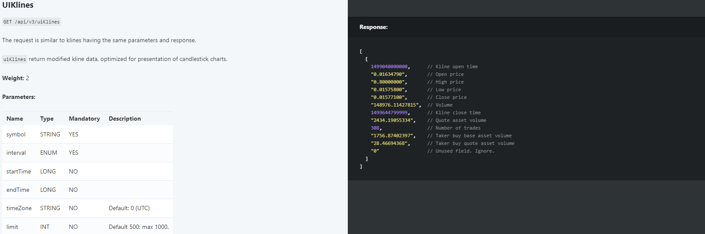

### Информация о получении данных на Binance для пары BTCUSDT

Открываем [сайт Binance][def] и видим:


В левой части экрана представлен биржевой стакан (Orderbook).

В середине мы видим график цен.

В правой части экрана лента сделок (сделки на рынке).

**Ордербук (Orderbook)**
---
Ордербук — это таблица, отображающая текущие заявки на покупку (bids) и продажу (asks) криптовалюты. В нем указаны цены и объемы заявок.

**Данные ордербука:**
- **Bids (покупки):** Заявки на покупку с указанием цены и объема.
- **Asks (продажи):** Заявки на продажу с указанием цены и объема.

**Лента сделок (Trade History)**
---
Лента сделок показывает информацию о последних совершенных сделках на бирже, включая цены, объемы и время.

**Данные ленты сделок:**
- **Price (цена):** Цена, по которой была совершена сделка.
- **Quantity (объем):** Объем сделки.
- **Time (время):** Время совершения сделки.
- **Buyer/Seller:** Идентификатор покупателя или продавца (если не был скрыт).

**График цены (Price Chart)**
---
График цены показывает исторические данные по ценам в виде свечей, где каждая свеча отображает открытие, закрытие, максимальную и минимальную цену за определенный период.

**Данные графика цены:**
- **Open (открытие):** Цена открытия.
- **Close (закрытие):** Цена закрытия.
- **High (максимум):** Максимальная цена.
- **Low (минимум):** Минимальная цена.
- **Volume (объем):** Объем торгов за период.

### Общая механика получения данных:

1. **Получение снэпшотов:**
   REST API используется для получения начальных данных для ордербука, ленты сделок и графика цены.

2. **Получение обновлений:**
   WebSocket API используется для получения обновлений данных в реальном времени.

### Запросы, которые были отправлены для получения первоначальных данных:

**Ордербук:**
---

```http
Request URL: https://www.binance.com/api/v3/depth?symbol=BTCUSDT&limit=1000
Request Method: GET
Status Code: 200 OK
```

В качестве ответа мы получили текущее состояние стакана
```json
{
"lastUpdateId": 48306097918,
    "bids": [
        [
            "60455.97000000",
            "6.45570000"
        ],
        ...
    ],
    "asks": [
        [
            "60455.98000000",
            "2.63265000"
        ],
        ...
    ]
}
```

Что соответствует документации 


**Лента сделок:**
---

```http
Request URL: https://www.binance.com/api/v1/aggTrades?limit=80&symbol=BTCUSDT
Request Method: GET
Status Code: 200 OK
```

В качестве ответа мы получили 
```json
[
    {
        "a": 3050048916,
        "p": "60433.06000000",
        "q": "0.00118000",
        "f": 3654215348,
        "l": 3654215348,
        "T": 1719602513511,
        "m": false,
        "M": true
    },
    {
        "a": 3050048917,
        "p": "60433.06000000",
        "q": "0.00118000",
        "f": 3654215349,
        "l": 3654215349,
        "T": 1719602513511,
        "m": false,
        "M": true
    },
    ...
]
```
Что соответствует документации 


**График цены:**
---

```http
Request URL: https://www.binance.com/api/v3/uiKlines?limit=1000&symbol=BTCUSDT&interval=1d
Request Method: GET
Status Code: 200 OK
```
В качестве ответа мы получили 
```json
[
    [
        1633219200000,
        "47634.89000000",
        "49228.08000000",
        "47088.00000000",
        "48200.01000000",
        "30825.05601000",
        1633305599999,
        "1482764462.19057740",
        1114294,
        "15426.81514000",
        "742443046.40754920",
        "0"
    ],
    [
        1633305600000,
        "48200.01000000",
        "49536.12000000",
        "46891.00000000",
        "49224.94000000",
        "46796.49372000",
        1633391999999,
        "2258464361.12635660",
        1437692,
        "23032.49140000",
        "1112232800.78865170",
        "0"
    ],
    ...
]
```
Что соответствует документации 



### Для обновления данных был отправлен следующий запрос:

```http
Request URL: wss://stream.binance.com/stream
Request Method: GET
Status Code: 101 Switching Protocols
```
С сообщением:
```json
{
  "id": 1,
  "method": "SUBSCRIBE",
  "params": [
    "!miniTicker@arr@3000ms",
    "btcusdt@aggTrade",
    "btcusdt@kline_1d",
    "btcusdt@depth"
  ]
}
```

Таким образом мы подписались на обновление ленты сделок (btcusdt@aggTrade), графика цен (btcusdt@kline_1d) и ордербука (btcusdt@depth) и на  получение данных обо всех торговых парах каждые 3 секунды (miniTicker@arr@3000ms).

В качестве ответа мы получаем
### Лента сделок
```json
{
  "data": {
    "e": "aggTrade",
    "E": 1719602517329,
    "s": "BTCUSDT",
    "a": 3050049128,
    "p": "60455.98000000",
    "q": "0.02200000"
  },
  "stream": "btcusdt@aggTrade"
}
```
Поля:
- e: Тип события ("aggTrade" - агрегированная сделка).
- E: Время события в миллисекундах. 
- s: Торговая пара (здесь "BTCUSDT").
- a: ID агрегированной сделки.
- p: Цена сделки.
- q: Объем сделки.
- stream: Имя потока (здесь "btcusdt@aggTrade").

### График цен
```json
{
  "data": {
    "e": "kline",
    "E": 1719602518849,
    "s": "BTCUSDT",
    "k": {
      "t": 1719532800000,
      "T": 1719619199999,
      "s": "BTCUSDT",
      "i": "1d",
      "f": 3652975203,
      "L": 3654215633,
      "o": "61706.46000000",
      "c": "60451.99000000",
      "h": "62225.31000000",
      "l": "60297.90000000",
      "v": "11085.99814000",
      "n": 1240431,
      "x": false,
      "q": "1325905064.75398010",
      "V": "21604.36703000",
      "Q": "680485397.16587060",
      "B": "0"
    }
  },
  "stream": "btcusdt@kline_1d"
}
```
Поля:
- e: Тип события ("kline" - свеча).
- E: Время события в миллисекундах.
- s: Торговая пара (здесь "BTCUSDT").
- k: Объект данных свечи:
  - t: Время открытия свечи.
  - T: Время закрытия свечи.
  - s: Торговая пара (здесь "BTCUSDT").
  - i: Интервал свечи (здесь "1d" - один день).
  - f: Начальный trade ID.
  - L: Конечный trade ID.
  - o: Цена открытия.
  - c: Цена закрытия.
  - h: Максимальная цена.
  - l: Минимальная цена.
  - v: Объем торгов.
  - n: Количество сделок.
  - x: Свеча закрыта (true или false).
  - q: Объем торгов в валюте котировки.
  - V: Объем покупок по рынку.
  - Q: Объем покупок в валюте котировки.
  - B: Ignore (можно игнорировать).
- stream: Имя потока (здесь "btcusdt@kline_1d").
### Ордербук
```json
{
  "data": {
    "e": "depthUpdate",
    "E": 1719602518589,
    "s": "BTCUSDT",
    "U": 48306097853,
    "u": 48306098637,
    "a": [
      ["60451.99000000", "7.93363000"],
      ["60452.00000000", "0.07430000"],
      ["60452.01000000", "0.28014000"]
    ],
    "b": [
      ["60455.97000000", "0.00000000"],
      ["60454.18000000", "0.00000000"],
      ["60454.17000000", "0.00000000"]
    ]
  },
  "stream": "btcusdt@depth"
}
```
Поля:

- e: Тип события ("depthUpdate" - обновление ордербука).
- E: Время события в миллисекундах.
- s: Торговая пара (здесь "BTCUSDT").
- U: Начальный update ID для событий.
- u: Конечный update ID для событий.
- a: Массив заявок на продажу (asks), каждая запись содержит цену и количество.
- b: Массив заявок на покупку (bids), каждая запись содержит цену и количество.
- stream: Имя потока (здесь "btcusdt@depth").

[def]: https://www.binance.com/ru/trade/BTC_USDT?_from=markets&type=spot